# VOIS_iosAPP

Mobile Application for blind and the visually impaired. Now with IRIS you can determine your colors, identify the denomination of the Egyptian currency and count it on the go, Detect: Brightness and objects and also read texts. 

## App Structure
IRIS is following the MVC pattern.

  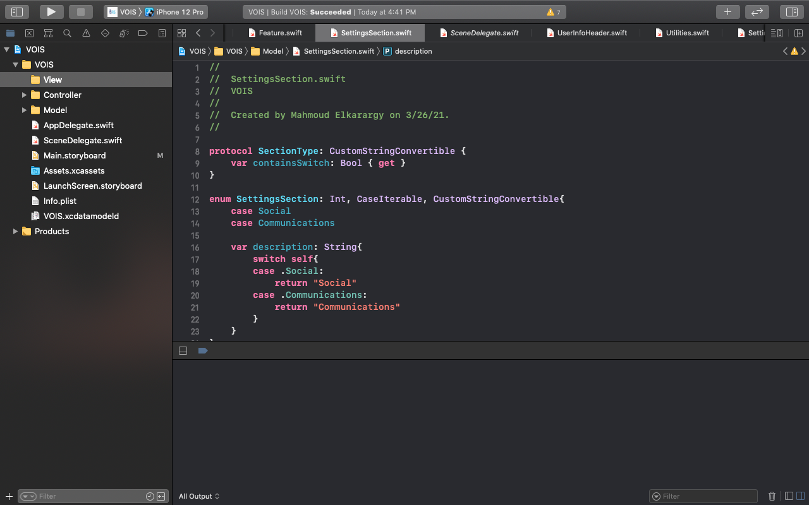

## Login/Signup Screen
- Allows the user to choose between Login or Sign Up. 
- It’s animated with a background video.

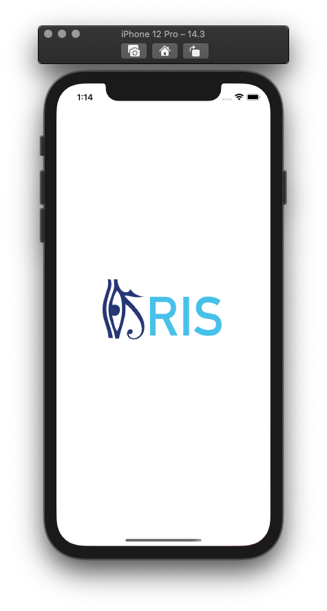
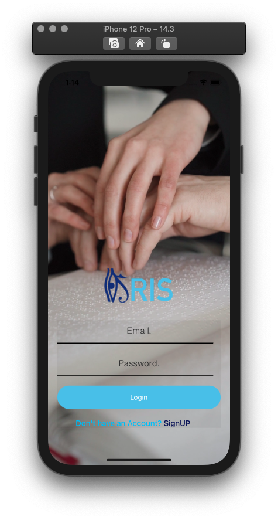

## Home Screen
### Features
- Allows the user to choose from different features like(Money counter, Brightness Detection, Object Detection, Text Detection and Color Detetction)

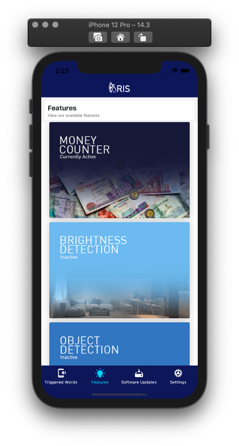
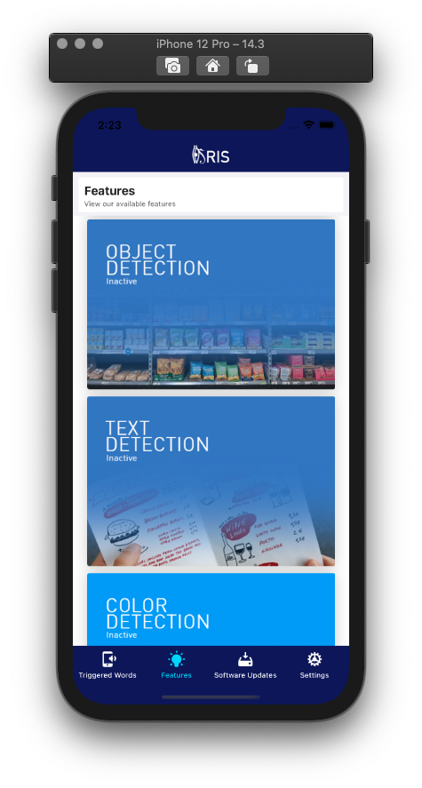
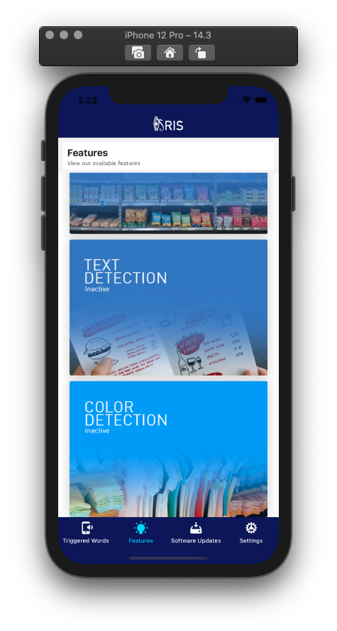

### Trigger Word
- Allows user to set a recorded voice to trigger a command.
- User can easily record new trigger word, Replace old one and play the voice audio.

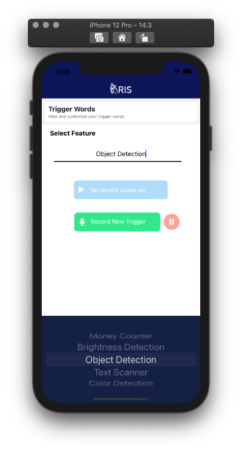
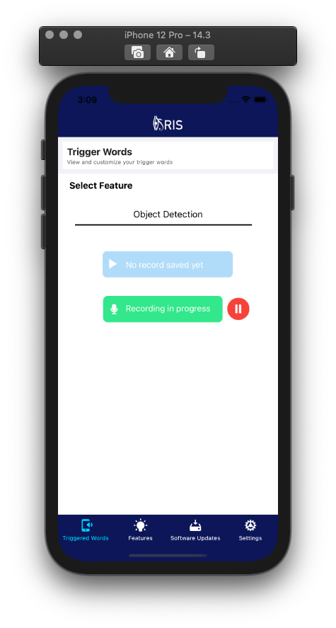
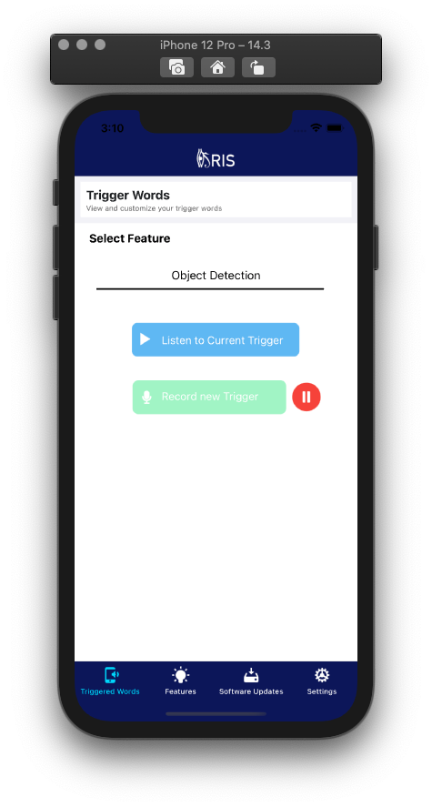

### Software Updates
- Keeps user updated to the latest versions to fully enjoy IRIS features.

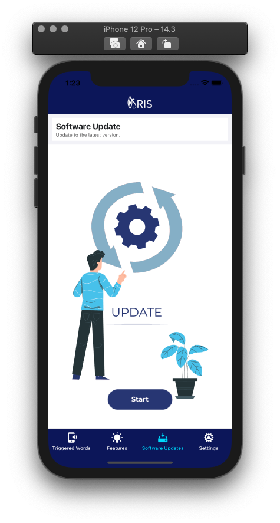

### Settings
- User can easily adjust his/her prefered settings.
- Also, change the App language and the output voice language.

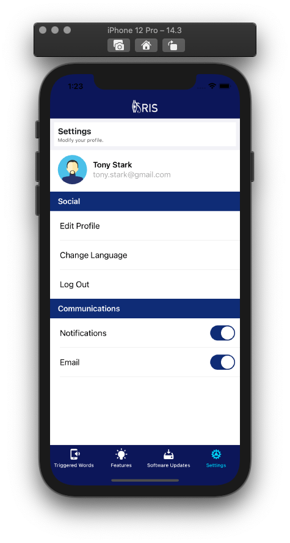

## VOIS HACKATHON
Event by _VOIS Technology Egypt and Vodafone, in collaboration with the Ministry of Communications and Information Technology, the ITI, the NTI and the ITIDA. 
* Held from 25 to 28 of March.

All all rights reserved &copy; 2021, IRIS Team.
